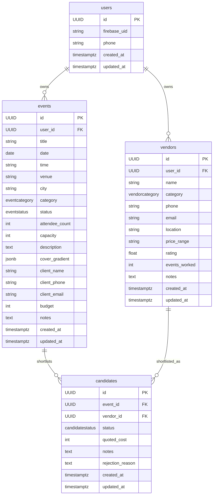

# Database Schema

PostgreSQL database. Migrations managed with Alembic.

## Tables

### users

| Column | Type | Nullable | Notes |
|---|---|---|---|
| id | UUID | No | Primary key, auto-generated |
| firebase_uid | VARCHAR(128) | No | Unique, from Firebase auth |
| phone | VARCHAR(32) | Yes | E.164 phone number from Firebase |
| created_at | TIMESTAMPTZ | No | Set at creation |
| updated_at | TIMESTAMPTZ | No | Updated automatically on change |

**Indexes:**
- `ix_users_firebase_uid` on `(firebase_uid)` — used by every authenticated request

---

### events

| Column | Type | Nullable | Notes |
|---|---|---|---|
| id | UUID | No | Primary key |
| user_id | UUID | No | FK → users.id ON DELETE CASCADE |
| title | VARCHAR(255) | No | |
| date | DATE | No | |
| time | VARCHAR(50) | Yes | Display string, e.g. "7:00 PM" |
| venue | VARCHAR(255) | No | Default `""` |
| city | VARCHAR(100) | Yes | |
| category | eventcategory | No | Enum: music, corporate, wedding, sports, art, food |
| status | eventstatus | No | Enum: upcoming, ongoing, past, cancelled. Default upcoming |
| attendee_count | INTEGER | No | Default 0 |
| capacity | INTEGER | No | Default 100 |
| description | TEXT | Yes | |
| cover_gradient | JSONB | Yes | Array of ARGB int values |
| client_name | VARCHAR(255) | Yes | |
| client_phone | VARCHAR(50) | Yes | |
| client_email | VARCHAR(255) | Yes | |
| budget | INTEGER | Yes | ₹ thousands |
| notes | TEXT | Yes | |
| created_at | TIMESTAMPTZ | No | |
| updated_at | TIMESTAMPTZ | No | |

**Indexes:**
- `ix_events_user_id` on `(user_id)` — primary filter for all event queries
- `ix_events_status` on `(status)` — used by status filter in list_events
- `ix_events_date` on `(date)` — used by ORDER BY date in list_events

---

### vendors

| Column | Type | Nullable | Notes |
|---|---|---|---|
| id | UUID | No | Primary key |
| user_id | UUID | No | FK → users.id ON DELETE CASCADE |
| name | VARCHAR(255) | No | |
| category | vendorcategory | No | Enum: catering, photography, music, decoration, venue, lighting, av, security, transport, other |
| phone | VARCHAR(50) | No | |
| email | VARCHAR(255) | Yes | |
| location | VARCHAR(255) | Yes | |
| price_range | VARCHAR(100) | Yes | |
| rating | FLOAT | No | Default 0.0 |
| events_worked | INTEGER | No | Default 0 |
| notes | TEXT | Yes | |
| created_at | TIMESTAMPTZ | No | |
| updated_at | TIMESTAMPTZ | No | |

**Indexes:**
- `ix_vendors_user_id` on `(user_id)`
- `ix_vendors_category` on `(category)` — used by category filter in list_vendors
- `ix_vendors_rating` on `(rating)` — used by min_rating filter and ORDER BY rating

---

### candidates

| Column | Type | Nullable | Notes |
|---|---|---|---|
| id | UUID | No | Primary key |
| event_id | UUID | No | FK → events.id ON DELETE CASCADE |
| vendor_id | UUID | No | FK → vendors.id ON DELETE CASCADE |
| status | candidatestatus | No | Enum values: shortlisted, awaitingConfirmation, finalised, rejected. Default shortlisted |
| quoted_cost | INTEGER | Yes | ₹ thousands |
| notes | TEXT | Yes | |
| rejection_reason | TEXT | Yes | |
| created_at | TIMESTAMPTZ | No | |
| updated_at | TIMESTAMPTZ | No | |

**Constraints:**
- `uq_candidate_event_vendor` UNIQUE on `(event_id, vendor_id)` — prevents duplicate shortlisting

**Indexes:**
- `ix_candidates_event_id` on `(event_id)` — primary filter for candidate queries
- `ix_candidates_vendor_id` on `(vendor_id)`
- `ix_candidates_status` on `(status)`

---

## Enum Types

| Name | Values |
|---|---|
| eventcategory | music, corporate, wedding, sports, art, food |
| eventstatus | upcoming, ongoing, past, cancelled |
| vendorcategory | catering, photography, music, decoration, venue, lighting, av, security, transport, other |
| candidatestatus | shortlisted, awaitingConfirmation, finalised, rejected |

Note: `candidatestatus` stores the enum `.value` (e.g. `awaitingConfirmation`), not the Python `.name` (`awaiting_confirmation`). This is controlled via `values_callable` in the SQLAlchemy model.

---

## ER Diagram



---

## Migrations

| File | Revision | Description |
|---|---|---|
| `alembic/versions/0001_initial.py` | 0001 | Initial schema — all tables, enum types, and indexes |

Run migrations:
```bash
alembic upgrade head
```

Roll back:
```bash
alembic downgrade base
```
